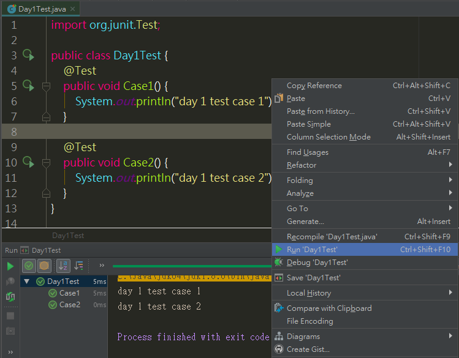
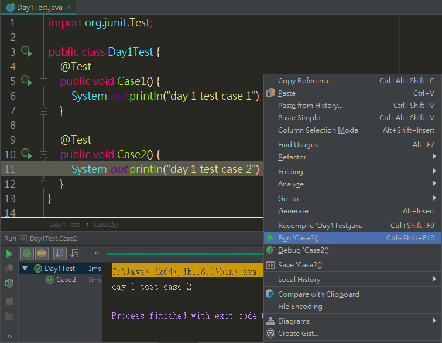
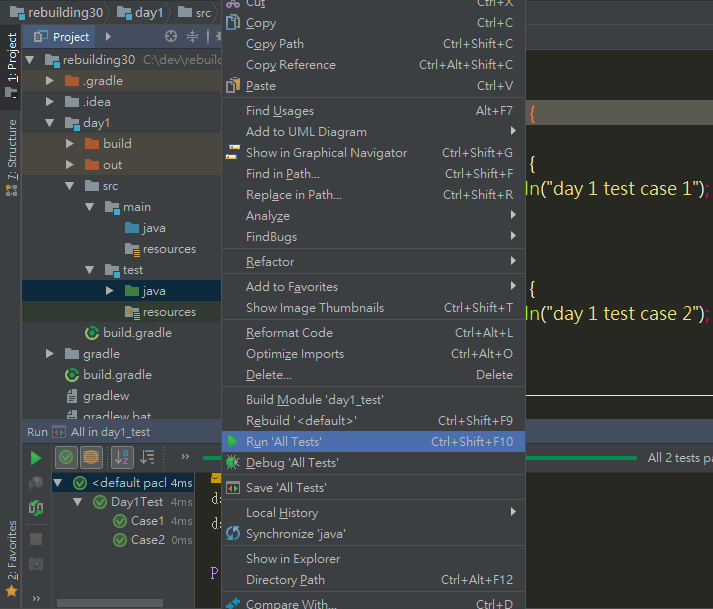

在開發的這些日子裡，有一段時間總是讓人覺得艱難，那就是要上線的前一刻。因為我們可能手動測了很多，卻總是覺得好像還漏了些什麼而感到不安；既使上線成功，也難保發生意外狀況時我們可以在最快的時間內解決，為了解決不安的心情，多一點勇氣執行部署，所以重修就從測試這門科目開始，期望能透過自動測試，解放手動消耗的人力、時間及資源。

## JUnit介紹

在JAVA的領域裡，談到測試框架，JUnit是最多人使用的，它可以幫助我們編寫單元測試、整合測試等，並有測試分類、測試運行器等功能，雖然近期大更新發展到了5.0版本，但在這裡會先使用JUnit 4.12的版本來進行演練。


## 準備

- JDK版本：1.8
- IDE：Intellij IDEA 2017.3
- gradle：4.0

資料夾的配置如下，並包含gradle的建構設定檔：
> - day1
>    - src
>       - main
>          - java
>          - resources
>       - test
>          - java
>          - resources
>    - build.gradle


再來要將JUnit的套件庫引用進來，過程中除了使用IDE來進行測試以外，也會透過gralde這樣的建構工具來執行。以下進行gradle的配置：

build.gradle
```java
apply plugin: 'java'

sourceCompatibility = 1.8
targetCompatibility = 1.8

repositories {
    mavenCentral()
}

dependencies {
    testCompile group: 'junit', name: 'junit', version: '4.12'
}
```
> 使用testCompile引入的套件只有在測試的時候才會用，未來如果有需要執行上線包版，則不會把junit包到WEB-INF/lib底下。

接下來，就來建立一個可執行的測試吧。

## 建立測試類別與測試案例

### 1. 建立測試類別

首先到路徑`src/test/java`底下，建立我們的第一個測試類別：
```java
import org.junit.Test;

public class Day1Test {

}
```

這裡有三點要注意
- 測試類別必須是公開的(public)
- 測試類別的命名，依照慣例是待測類別的名稱加上後綴字，在這裡可以解釋成對Day1類別進行測試，所以會是Day1Test
- 測試類別的package，依照慣例會與待測類別的路徑相同，如：
    - 待測類別src/main/java：com/jiang/service/Day1.java
    - 測試類別src/test/java：com/jiang/service/Day1Test.java


### 2. 加入測試案例(Test Case)

然後，建立我們的第一組測試案例，通過`@Test`標註在`public void`方法上來達成
```java
import org.junit.Test;

public class Day1Test {
    @Test
    public void Case1() {
        System.out.println("day 1 test case 1");
    }

    @Test
    public void Case2() {
        System.out.println("day 1 test case 2");
    }
}
```

## 執行測試與查看結果

### 1. 開始執行測試

我們可以透過以下兩種方法執行
- IDE內建功能執行，這裡使用Intellij示範
   - 在測試類別上執行，此類別內的測試案例會全部執行
   
   - 僅針對單一測試案例執行
   
   - 對所有測試類別執行
   
   
- 透過gradle執行測試，使用command line
   - 下指令`gradle test`
   


### 2. 查看結果

以上測試執行結果都是綠燈通過，這是因為目前編寫的測試並沒有執行斷言(Assertion)或者有Exception的拋出。

注意到使用gradle進行測試，預設是不會拋出任何System.out的訊息的。


---
今天就先到這裡了，謝謝閱讀。

wow，最簡單的第一篇文章就花費了我好多時間編寫阿，希望接下來能漸入佳境阿～