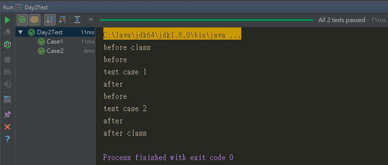
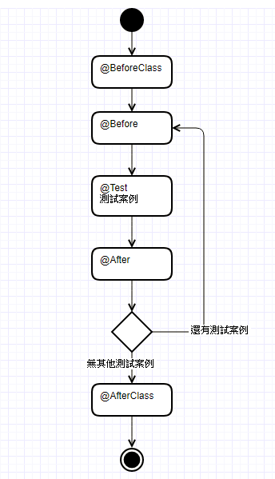

## 執行順序Annotation

在JUnit 4的版本中，有了幾個Annotation，幫我們設定在測試案例的之前進行配置及之後進行釋放資源的方法，如下：

1. `@BeforeClass`
2. `@Before`
3. `@After`
4. `@AfterClass`

雖然按照字面上來看，可以大概猜出來他們的執行順序，但實際上是如何執行的，我們可以參考以下的範例

```java
import org.junit.*;

public class Day2Test {
    @BeforeClass
    public static void beforeClass() {
        System.out.println("before class");
    }

    @Before
    public void before() {
        System.out.println("before");
    }

    @After
    public void after() {
        System.out.println("after");
    }

    @AfterClass
    public static void afterClass() {
        System.out.println("after class");
    }

    @Test
    public void Case1() {
        System.out.println("test case 1");
    }

    @Test
    public void Case2() {
        System.out.println("test case 2");
    }
}
```
實際實行結果



參考活動圖




1. `@BeforeClass` 是一個*public static void*的方法，會在所有測試案例之前僅執行一次，用於共享消耗較多的執行，譬如開啟資料庫連結。
2. `@Before` 是一個*public void*的方法，會在每一個測試案例之前執行，有幾個案例就執行幾次，一般來說會遇到一些測試案例在執行前須建立相同的物件，可以透過此方法來每次執行
3. `@After` 是一個*public void*的方法，會在每一個測試案例之後執行，有幾個案例就執行幾次，當測試案例執行完後，需要重置資源，可以透過此方法執行
4. `@AfterClass` 是一個*public static void*的方法，會在所有測試案例之後僅執行一次，用於釋放共享消耗的資源。


接下來，讓我們建立一個簡單的待測類別，並且編寫斷言來完成一組測試案例

## 建立一個簡單的待測類別

```java

```

## 編寫斷言進行測試