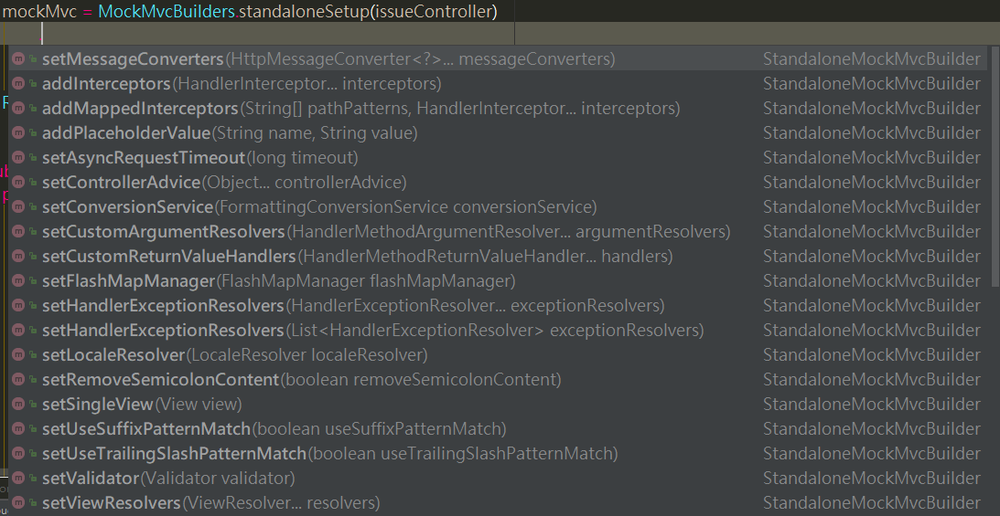

# Spring MVC Controller Unit Test《一》

Spring是當前Java界最重要的框架(沒有之一)，除了核心模組帶來的容器、控制反轉、AOP的概念以外，還有各式各樣的強大可選模組，是一個為企業應用不斷帶來火力支援的開源框架。

在接下來的篇章，將會專心研究Spring網站應用架構上的幾種測試作法，希望能在最後的十天裡，取得讓人安心下班的技術力。

---

本篇章要介紹如何透過Spring MVC Test Framework來編寫單元測試。

因為個人使用的網站架構是前後端分離(~~篇幅不夠~~)，所以將會著重於研究如何測試RESTful API式的Spring Controller。另外，使用的Spring為4.2.X，並且沒有使用Spring Boot。

## Spring Mvc Test Framework簡介

- 支援JUnit與TestNG
- 建立在Spring-test提供的Servlet API模擬物件之上，因此不需正在執行的Servlet container
- 它使用DispatcherServlet提供完全的Spring MVC執行時期行為的支援。
- 可以使用獨立配置或基於Web context的設定來配置待測系統

## Spring MVC Test Framework主要元件介紹

- 想要設定Spring MVC context時，則使用以下元件
    - MockMvcBuilders類別提供建立MockMvc物件的靜態方法。
    - MockMvc物件就像一個可以處理http request的controller模擬
    - 有兩種設定Spring MVC基礎配置的方式
        1. 獨立配置。使用MockMvcBuilders類別提供的方法standaloneSetup(controller)回傳的物件StandaloneMockMvcBuilder來自行設定。(建議)
        2. 基於設定好的Context配置。使用MockMvcBuilders類別提供的方法webAppContextSetup來傳入設定好的WebApplicationContext或xml設定檔進行設定。

- 想要模擬發送http request，並為回傳的response編寫斷言，則使用以下元件
    - MockMvcRequestBuilders類別提供了靜態方法，可以建立http request並發送。
    - MockMvcResultMatchers類別提供了靜態方法，可以使用它來為回傳的Http response編寫斷言。
    - MockMvcResultHandlers類別提供了靜態方法，可以使用這些方法來印出回傳的response。

想要使用Spring MVC Test Framework來編寫單元測試，必須先載入`spring-test`，在這裡列出完整的gradle設定檔：
```java
group 'com.jiang'
version '1.0-SNAPSHOT'

apply plugin: 'java'
apply plugin: 'war'

sourceCompatibility = 1.8

repositories {
    mavenCentral()
}

dependencies {
    compile group: 'org.springframework', name: 'spring-webmvc', version: '4.2.9.RELEASE'
    compile group: 'com.fasterxml.jackson.core', name: 'jackson-databind', version: '2.9.3'
    compile group: 'javax.servlet', name: 'javax.servlet-api', version: '3.1.0'
    compile group: 'org.slf4j', name: 'slf4j-api', version: '1.7.25'
    compile group: 'log4j', name: 'log4j', version: '1.2.17'
    compile group: 'org.slf4j', name: 'slf4j-log4j12', version: '1.7.25'
    compile group: 'org.slf4j', name: 'jcl-over-slf4j', version: '1.7.25'

    testCompile group: 'org.springframework', name: 'spring-test', version: '4.2.9.RELEASE'
    testCompile group: 'com.jayway.jsonpath', name: 'json-path', version: '2.4.0'

    testCompile group: 'junit', name: 'junit', version: '4.12'
    testCompile group: 'de.bechte.junit', name: 'junit-hierarchicalcontextrunner', version: '4.12.1'
    testCompile group: 'org.mockito', name: 'mockito-core', version: '2.13.0'
    testCompile group: 'org.assertj', name: 'assertj-core', version: '3.8.0'
    testCompile group: 'org.hamcrest', name: 'hamcrest-library', version: '1.3'
}

test {
    testLogging {
        showStandardStreams = true
    }
}
```

## 建立 MockMvc

編寫Controller單元測試時，一開始必須建立一個新的MockMvc物件，作為測試的進入點，在這裡將會使用MockMvcBuilders.standaloneSetup(controller)進行獨立配置。
> P.S.如果透過MockMvcBuilders.webAppContextSetup()來讀取Context Configuration類別或Xml設定檔進行配置，這意味著設定檔必須為了符合測試而進行調整，但實際上每一個Controller可能具有不同的context配置或者測試替身必須建立的複雜情境，所以這裡選用獨立配置的方式來進行。並且因為不使用SpringJUnit4ClassRunner，得以讓我們使用HierarchicalContextRunner來編寫巢狀單元測試。

以下以最簡單的方式建立一個MockMvc物件作為示範：
1. 建立IssueController的測試類別IssueControllerTest
2. 加入屬性MockMvc
3. 建立`@Before` setup方法，在每個測試案例之前建立新的MockMvc物件
4. 建立待測的IssueController物件，並傳入MockMvcBuilders.standaloneSetup()進行設定，並回傳StandaloneMockMvcBuilder類別。
5. 透過StandaloneMockMvcBuilder設定其他Web Context配置如ObjectMapper、LocaleResolver，最後使用方法build()建立MockMvc物件。
```java
@RunWith(HierarchicalContextRunner.class)
public class IssueControllerTest {
    private MockMvc mockMvc;

    @Before
    public void configIssueController() {
        IssueController issueController = new IssueController();

        mockMvc = MockMvcBuilders.standaloneSetup(issueController)
                .build();
    }
}
```

透過以上步驟建立了一個最簡易的MockMvc物件，但通常我們都還有其他額外的配置，假設在測試類別中直接進行配置，則會產生重複的程式碼散落，讓我們的測試類別變得難以維護。可以透過建立一個共用類別來解決這個問題。

## 給MockMvc加入額外的配置

建立一個ObjectMother類別，並加入提供各種元件的工廠方法，這使得設定不會散落各地，維護變得容易許多。
1. 加入提供MappingJackson2HttpMessageConverter的方法，用來讀寫json的常用套件。
2. 加入提供ObjectMapper的方法，轉成json時會略過空字串、null等
```java
public final class TestContextConfig {

    private TestContextConfig() {
    }

    public static MappingJackson2HttpMessageConverter objectMapperHttpMessageConverter() {
        MappingJackson2HttpMessageConverter converter = new MappingJackson2HttpMessageConverter();
        converter.setObjectMapper(objectMapper());
        return converter;
    }

    public static ObjectMapper objectMapper() {
        ObjectMapper objectMapper = new ObjectMapper();
        objectMapper.setSerializationInclusion(JsonInclude.Include.NON_EMPTY);
        return objectMapper;
    }
}
```

然後就可以使用MockMvcBuilders.standaloneSetup()回傳的StandaloneMockMvcBuilder來進行配置，這邊以配置messageConverters來作為例子：
```java
@RunWith(HierarchicalContextRunner.class)
public class IssueControllerTest {
    private MockMvc mockMvc;

    @Before
    public void configIssueController() {
        IssueController issueController = new IssueController();

        mockMvc = MockMvcBuilders.standaloneSetup(issueController)
                .setMessageConverters(TestContextConfig.objectMapperHttpMessageConverter())
                .build();
    }
}
```

除了setMessageConverters以外，還可以看到StandaloneMockMvcBuilder提供了數種方法讓我們來進行配置，如下：


本篇先介紹了Spring Mvc Test Framework主要元件，如何建立MockMvc物件，還有建立一個共用設定的ObjectMother；下一篇就要介紹怎麼編寫測試類別並且使用MockMvc發動mock request，並且驗證回傳結果。