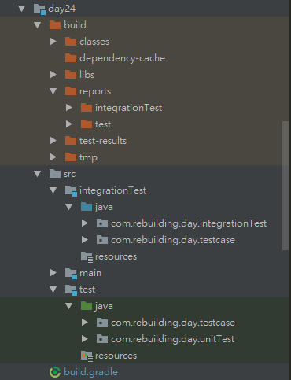

# 整合測試《一》

結束了單元測試，下個階段就要進行整合測試，接下來的篇章就要研究如何做到這件事，一開始會有蠻多配置需要去做的，耐心看下去吧。

# Gradle整合測試配置

在這裡會透過使用Gradle來達到以下整合測試所需的建構：
- 指定整合測試目錄：`src/integrationTest/java`包含測試程式，`src/integrationTest/resources`包含所需資源
- 可以執行單元測試、整合測試及所有測試
- 如果整合測試失敗(integrationTest test fail)，建構也必須失敗
- 整合測試及單元測試必須有不同的report目錄

以下將引用gradle plugin `org.unbroken-dome.test-sets`來簡化整合測試所需的配置，請看以下build.gradle程式碼及說明：
```java
plugins {
    id 'java'
    /**
     * 1. 引入plugin簡化整合測試配置
     */
    id 'org.unbroken-dome.test-sets' version '1.4.2'
}

/**
 * 2. 設定整合測試，這將會從目錄`src/integrationTest/java`，`src/integrationTest/resources`取得資訊進行整合測試
 */
testSets {
    integrationTest { dirName = 'integrationTest' }
}

/**
 * 3. 指定整合測試任務在check任務之前執行，則任務視為失敗
 * 指定執行整合測試之前必須先執行單元測試
 */
check.dependsOn integrationTest
integrationTest.mustRunAfter test

/**
* 4. 指定單元測試及整合測試的HTML報告，放置到各自的資料夾
*/
tasks.withType(Test) {
    reports.html.destination file("${reporting.baseDir}/${name}")
}

repositories {
    mavenCentral()
}

dependencies {
    testCompile group: 'junit', name: 'junit', version: '4.12'
    /**
     * 5. 可以配置整合測試Compile以及Runtime階段所需的相依套件，已經包含testCompile所有的相依套件
     **/
    // integrationTestCompile(
    // )
    // integrationTestRuntime(
    // )
}

test {
    useJUnit {
        includeCategories 'com.rebuilding.day.unitTest.UnitTest'
    }
    testLogging {
        showStandardStreams = true
    }
}

/**
* 6. 新增整合測試的設定@Category(IntegrationTest.class)，指定使用JUnit執行單元測試，並且指定介面@Category(IntegrationTest.class)限制執行類別
*/
integrationTest {
    useJUnit {
        includeCategories 'com.rebuilding.day.integrationTest.IntegrationTest'
    }
    testLogging {
        showStandardStreams = true
    }
}
```

設定好build.gradle之後，我們可以選擇執行以下task
1. 執行單元測試：`gradle clean test`
2. 執行建構並排除整合測試：`gradle clean build -x integrationTest`
3. 執行整合測試：`gradle clean integrationTest`
4. 執行建構並排除單元測試：`gradle clean build -x test`
5. 執行單元測試及整合測試`gradle clean test integrationTest`
6. 執行完整建構：`gradle clean build`

以下展示使用此方式建構的目錄結構



-----

# Spring整合測試配置

Spring Test Framework支援整合測試，它有幾個特性：
1. 支援依賴注入，可以編寫xml或JavaConfig設定context，將Spring bean注入到整合測試的待測類別中。
2. 支援cache context，不同的測試類別中如果有相同的context，則只需要載入一次，加快執行速度。
3. 支援Transaction management，預設會建立transaction及執行roll back。也可以透過@Transactional定義。

在配置整合測試context之前先看一下待測系統
1. IssueRepositoryImp：帶有方法getBigIssue()回傳title為BIG的issue
```java
@Repository
public class IssueRepositoryImp implements IssueRepository {
    @Override
    public Issue getBigIssue() {
        Issue issue = new Issue();
        issue.setTitle("BIG");
        return issue;
    }
}
```

2. IssueServiceImp：注入issueRepository，帶有方法getBigIssue()
```java
@Service
public class IssueServiceImp implements IssueService {

    @Autowired
    private IssueRepository issueRepository;

    @Override
    public Issue getBigIssue() {
        return issueRepository.getBigIssue();
    }
}
```

## 編寫測試類別及context配置

測試類別配置，請看以下程式碼及說明：
```java
package com.rebuilding.day.testcase;

import com.rebuilding.day.entity.Issue;
import com.rebuilding.day.integrationTest.IntegrationTest;
import com.rebuilding.day.service.IssueService;
import org.junit.Test;
import org.junit.experimental.categories.Category;
import org.junit.runner.RunWith;
import org.springframework.beans.factory.annotation.Autowired;
import org.springframework.test.context.ContextConfiguration;
import org.springframework.test.context.junit4.SpringJUnit4ClassRunner;

/**
 * 1. 指定為整合測試
 */
@Category(IntegrationTest.class)
/**
 * 2. 確保整合測試使用Spring Test Framework之功能
 */
@RunWith(SpringJUnit4ClassRunner.class)
/**
 * 3. 使用@ContextConfiguration載入所需要的context
 * 或者使用xml
 * @ContextConfiguration(locations = {"classpath:issue-context.xml"})
 */
@ContextConfiguration(classes = {IssueContext.class})
public class GetIssueTest {
    /**
     * 由配置好的context注入所需的spring bean
     */
    @Autowired
    private IssueService issueService;

    /**
    * 測試案例，context已被建立，issueService.getBigIssue()才能順利執行
    **/
    @Test
    public void shouldReturnBigIssue() {
        Issue bigIssue = issueService.getBigIssue();
        String title = bigIssue.getTitle();
        assertThat(title).isEqualTo("BIG");
    }
}
```

編寫一個簡單的配置，但會為我們準備注入所需的Component，請依照所需情境設置。
```java
package com.rebuilding.day.testcase;

import org.springframework.context.annotation.ComponentScan;
import org.springframework.context.annotation.Configuration;

@Configuration
@ComponentScan(basePackages = {
    "com.rebuilding.day.repositroy",
    "com.rebuilding.day.service"
})
public class IssueContext {
}
```

最後執行`gradle clean integrationTest`，透過@RunWith(SpringJUnit4ClassRunner.class)，@ContextConfiguration的配合，

以上是整合測試所需的配置之一，下一篇將繼續前進～前進。