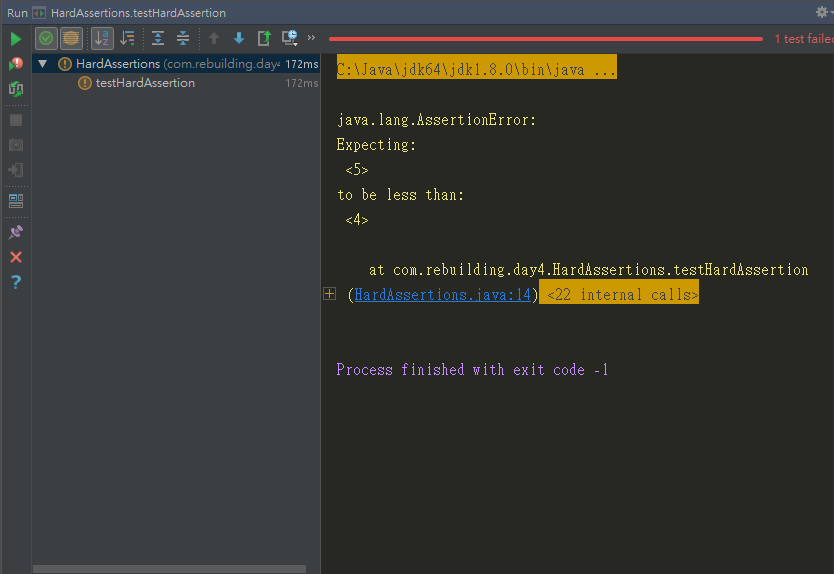
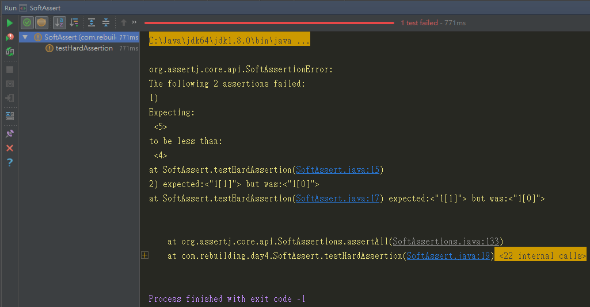

# 硬斷言、軟斷言、一個測試案例只測一件事

## Hard Assertions硬斷言

說在前頭，在前面談到的都是Hard Assertions硬斷言

What？？？什麼是硬斷言？？？

所謂的硬斷言就是當一個斷言發生錯誤的時候，會直接亮紅燈並拋出錯誤資訊，不會再執行下一個斷言，

這裡建立一個範例，在testHardAssertion方法中，我們建立了兩個會拋出錯誤的斷言
1. 5<4
2. "10" == "11"
```java
package com.rebuilding.day4;
import org.junit.Test;
import static org.assertj.core.api.Assertions.assertThat;

public class HardAssertions {
    @Test
    public void testHardAssertion() {
        int actual1 = 5;

        String actual2 = "10";

        assertThat(actual1).isLessThan(4);

        assertThat(actual2).isEqualTo("11");
    }
}

```

test run執行結果如下：


我們會發現執行到`assertThat(actual1).isLessThan(4)`就拋出錯誤訊息，且不往下執行，這就是硬斷言。

## 一個測試案例只測一件事

這裡要在提到另一個編寫測試的大原則，**一個測試案例只測一件事**

先從反面來說，當我們一個測試案例試圖驗證太多事情，會產生幾個問題

- 要給測試案例一個簡單明瞭的命名是不可能的。一個好的命名必須描述預期結果，但因為我們驗證太多東西，導致命名變長變複雜，甚至根本不可行。
- 會導致測試案例難以閱讀及維護。這也說明了我們的測試沒有一個明確的目標，甚至有可能將業務邏輯放進來。假設我們修改了一段邏輯，導致我們也必須對所有測試進行一些修正。
- 無法立即得知錯誤原因。每一次驗證，還要再去判斷是哪個斷言發生錯誤，無疑會耗費許多時間。
- 導致測試案例可能因為多種原因失敗。這會有一個很大的問題，有可能當你修復了這個測試案例中某一個驗證，卻發現裡面其實還有另外一個驗證錯誤，這使得我們必須不斷浪費時間執行相同的測試案例。

從正面來看的話，一個測試案例只測一件事為我們帶來的優點：簡單明瞭的測試案例命名，可以立即得知錯誤的原因，並且易於維護。

既使我們要使用軟斷言來做多個斷言驗證，也不會脫離這個原則

## Soft Assertions軟斷言

有時候我們需要驗證一個具有狀態的物件，通常要驗證它的時候會需要多個斷言，但如果用硬斷言的方式，會讓我們沒辦法一次收集完所有資訊，並且浪費時間在重新執行測試案例上。

所以這裡要介紹軟斷言，它是有以下三個規則的斷言：

1. 一個斷言錯誤，不會立即導致測試案例失敗，會繼續往下執行其他斷言
2. 所有的斷言錯誤會被收集起來提供之後使用
3. 最後所有的斷言執行完之後，如果有發現其中有斷言錯誤，則會導致斷言失敗，並顯示所有的錯誤

以上，我們可以透過AssertJ的org.assertj.core.api.SoftAssertions來達成

1. 首先，我們必須建立一個SoftAssertions物件
```java
package com.rebuilding.day4;
import org.assertj.core.api.SoftAssertions;
import org.junit.Test;

public class SoftAssert {
    @Test
    public void testHardAssertion() {

        int actual1 = 5;
        String actual2 = "10";

        SoftAssertions softAssertions = new SoftAssertions();
    }
}
```

2. 再來，使用softAssertions編寫我們的斷言，基本上與使用硬斷言無異
```java
package com.rebuilding.day4;
import org.assertj.core.api.SoftAssertions;
import org.junit.Test;

public class SoftAssert {
    @Test
    public void testHardAssertion() {

        int actual1 = 5;
        String actual2 = "10";

        SoftAssertions softAssertions = new SoftAssertions();

        softAssertions.assertThat(actual1).isLessThan(4);

        softAssertions.assertThat(actual2).isEqualTo("11");
    }
}
```

3. 最後，則必須調用assertAll()才能執行所有斷言，不然這個測試案例會沒有任何動作直接綠燈通過
```java
package com.rebuilding.day4;
import org.assertj.core.api.SoftAssertions;
import org.junit.Test;

public class SoftAssert {
    @Test
    public void testHardAssertion() {

        int actual1 = 5;
        String actual2 = "10";

        SoftAssertions softAssertions = new SoftAssertions();

        softAssertions.assertThat(actual1).isLessThan(4);

        softAssertions.assertThat(actual2).isEqualTo("11");

        softAssertions.assertAll();
    }
}
```

4. 執行結果



可以看到軟斷言幫我們收集了所有的錯誤，讓我們不用反覆重新執行測試來得知所有的訊息。

雖然軟斷言把物件狀態視為一個屬性來驗證，並且可以幫助我們保持反饋的速度，節省重新執行測試的時間，但他會帶來幾個問題。

## 注意事項

當我們寫測試的時候，我們必須遵守這樣的原則：

- 不應在測試方法中加入業務邏輯，不要造成維護上的困難
- 確保我們的測試易於讀寫

但使用軟斷言：

- 可能把業務邏輯加入到測試案例中，這會使得讀者的注意力會從測試本質，轉移到實現細節上，也就是說變得難以閱讀。
- 並且因為業務邏輯加入，當單一狀態的改變時，造成相關的測試也都需要進行變更，這造成維護上的困難。

所以一般情況下是不使用的好...


---
最後總結，使我覺得似乎講了一集廢話，不過有些思路是需要從中反覆驗證的。

以上。