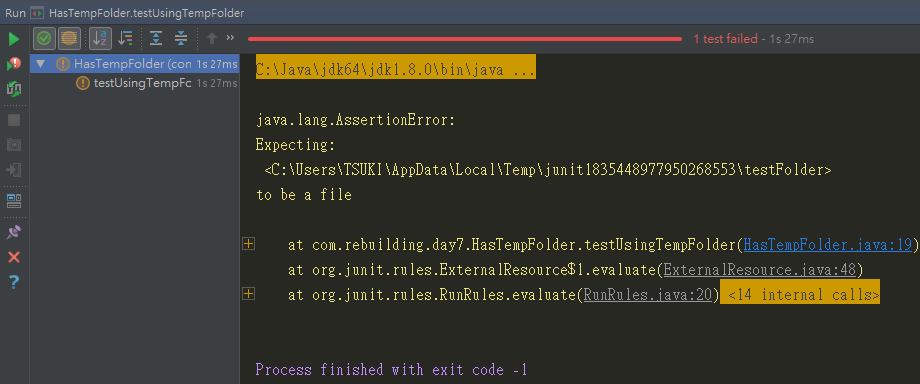

## JUnit Rule 介紹

1. 它是JUnit 4.7加入的元件
2. 它可以實現@Before、@After的功能
3. Rule允許彈性地加入或重新定義測試類別中每個測試方法的行為。
4. @Rule必須標註在測試類別的public field，其field類別必須實作TestRule介面。

在上一篇可以看到我們使用了JUnit提供的ExpectedException Rule，它幫我們執行了異常的捕捉
```java
public class IssueServiceTest4 {

    @Rule
    public ExpectedException thrown = ExpectedException.none();

    private static final Long ID = 1L;
    private IssueService issueService;
    @Before
    public void setup() {issueService = new IssueService();}

    @Test
    public void queryById_ShouldThrowException() {
        thrown.expect(EntityNotFoundException.class);
        issueService.queryById(ID);
    }
}
```

## TemporaryFolder Rule介紹

TemporaryFolder也是JUnit提供的基礎Rule，它可以幫我們建立暫時的資料夾或檔案，並在執行結束後刪除。

以下這個範例，我們使用了TemporaryFolder，並呼叫它的newFile方法建立一個暫時的檔案。

然後，我們故意斷言它是一個資料夾，造成驗證錯誤。

```java
package com.rebuilding.day7;

import org.junit.Rule;
import org.junit.Test;
import org.junit.rules.TemporaryFolder;
import java.io.File;
import java.io.IOException;

import static org.assertj.core.api.Assertions.assertThat;

public class HasTempFolder {
    @Rule
    public final TemporaryFolder folder = new TemporaryFolder();

    @Test
    public void testUsingTempFolder() throws IOException {
        File createdFile = folder.newFile("myfile.txt");
        assertThat(createdFile).isDirectory();
    }
}
```

執行結果：
可以看到它在我們的路徑底下建立了一個暫時的資料夾，並會在此測試結束後刪除


## 自定義Rule

以下做一個簡單的自定義Rule，加入了這個Rule的測試類別，會在測試案例的前後執行動作，依照以下步驟

1. 建立一個類別TestPrinter
2. 實作org.junit.rules.TestRule介面，並實作其方法apply(Statement base, Description description)
    - Statement base有一個evaluate方法，其實就是執行測試案例
    - Description description可以拿到測試類別的相關資料，這裡我們透過getDisplayName取的執行的類別路徑及方法名稱
3. apply()方法必須回傳Statement物件，且覆寫evaluate()方法，除了測試的執行(base.evaluate())，也可以在其前後加上需要的動作

```java
package com.rebuilding.day7;

import org.junit.rules.TestRule;
import org.junit.runner.Description;
import org.junit.runners.model.Statement;

public class TestPrinter implements TestRule {

    @Override
    public Statement apply(final Statement base, final Description description) {
        return new Statement() {
            @Override
            public void evaluate() throws Throwable {
                System.out.println("start " + description.getDisplayName());
                base.evaluate();
                System.out.println("end " + description.getDisplayName());
            }
        };
    }
}

```

使用自訂義Rule

這裡把TestPrinter加入到MyLoggerTest類別中，並使用@Rule標註

```java
package com.rebuilding.day7;

import org.junit.Rule;
import org.junit.Test;

public class MyLoggerTest {
    @Rule
    public final TestPrinter printer = new TestPrinter();

    @Test
    public void testCase1() {
        System.out.println("test case 11111");
    }

    @Test
    public void testCase2() {
        System.out.println("test case 22222");
    }
}
```

其執行結果
